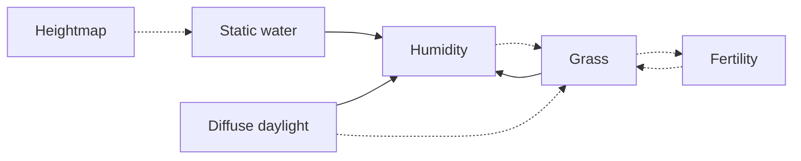

# Layers

A layer is one dense grid in the world, with its own cell size and clock. The file format of those grids is [version 3](../world-format/v3.md). This directory describes what each layer means, how that meaning has changed, and what its simulation function does.

The simulation status of a function is one of:

| Status        | Meaning                                                                 |
| ------------- | ----------------------------------------------------------------------- |
| Placeholder   | The engine calls a function that does not change the cells.            |
| Designed      | The steps below are the current definition. The code does not run them. |
| Implemented   | The engine runs the definition.                                         |
| Validated     | The running function has been checked and the result accepted.          |

## Status

| Layer                                      | Simulation    | Stored today                                      |
| ------------------------------------------ | ------------- | ------------------------------------------------- |
| [Heightmap](heightmap.md)                  | Placeholder   | `ST_D`, elevation offset                          |
| [Static water](static-water.md)            | Implemented   | `ST_D`, depth; the function never runs            |
| [Diffuse daylight](diffuse-light.md)       | Implemented   | `ST_D`, irradiance in W/m²                        |
| [Humidity](humidity.md)                    | Implemented   | `ST16`, 0 dry, 65535 saturated                   |
| [Fertility](fertility.md)                  | Placeholder   | `ST_8`, 0..255                                    |
| [Grass](grass.md)                          | Placeholder   | `ST_8`, millimetres of height, 0..255             |

Diffuse daylight was compared by hand with the half-sine curve on the pool world. That check is not a validation recorded in the repository, so the status stays implemented.

## What the engine does today

On a tick the engine visits each layer whose clock is due. Static water is never due. For every other due layer it copies `published` into `pending`, calls the layer function, and, after every due layer has been called, swaps the two buffers. Other layers read `published` only. The file stores `published` only.

A layer that is not due keeps the values from its last due tick. Readers still see those values.

`MODULAR` is stored. Wrapping belongs to the world, in `world_neighbor`. Any layer that asks for an orthogonal neighbour gets the same answer: on `MODULAR` the cell past one side is the cell on the other side, and on `CLOSED` that neighbour does not exist. Humidity is the only caller today. The flow it computes from that neighbour is its own rule.

## Dependencies

An arrow means the source is read, or receives a delta, when the destination runs. Dashed arrows are designed and are not in the code.

The heightmap does not feed the water grid. The viewer, and the meaning of the water surface, add the two elevations. Water cells are not derived from the heightmap by the simulation.

| Layer            | Reads while it runs                                      | Changes other layers                                      |
| ---------------- | -------------------------------------------------------- | --------------------------------------------------------- |
| Heightmap        | Nothing                                                  | Nothing                                                   |
| Static water     | Nothing. It does not run.                                | Nothing                                                   |
| Diffuse daylight | The world age                                            | Nothing. It does not evaporate humidity.                  |
| Humidity         | Its own grid, static water, published light, published grass | Nothing. Evaporation is its own rule, scaled by the grass height. |
| Fertility        | Not defined                                              | Not defined. It is expected to receive grass deltas.     |
| Grass            | Not defined                                              | Not defined. It is expected to push fertility deltas.    |

Two kinds of coupling are distinct:

* A layer may read a value that the other layer keeps publishing: water depth, irradiance, grass height used as shade. The reader owns the rule. The other layer does not write into it. Grass stays at the height stored in the file, because its own function does not change a cell.
* A layer that consumes a fact by changing its own state has to leave a signed delta for the layer that must receive it. Grass growth and grass death are that case. Humidity has no such inbox. The delta buffer is designed and is not stored or updated by the engine.
