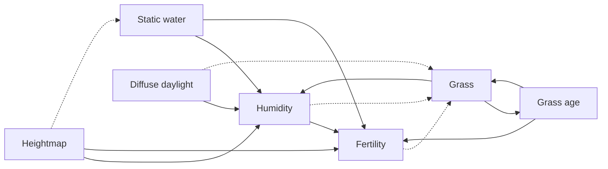

# Layers

A layer is one dense grid in the world, with its own cell size and clock. The file format of those grids is [version 3](../world-format/v3.md). This directory describes what each layer means, how that meaning has changed, and what its simulation function does.

The simulation status of a function is one of:

| Status        | Meaning                                                                 |
| ------------- | ----------------------------------------------------------------------- |
| Placeholder   | The engine calls a function that does not change the cells.            |
| Designed      | The steps below are the current definition. The code does not run them. |
| Implemented   | The engine runs the definition.                                         |
| Validated     | The running function has been checked and the result accepted.          |

## Status

| Layer                                      | Simulation    | Stored today                                      |
| ------------------------------------------ | ------------- | ------------------------------------------------- |
| [Heightmap](heightmap.md)                  | Placeholder   | `ST_D`, elevation offset                          |
| [Static water](static-water.md)            | Implemented   | `ST_D`, depth; the function never runs            |
| [Diffuse daylight](diffuse-light.md)       | Implemented   | `ST_D`, irradiance in W/m²                        |
| [Humidity](humidity.md)                    | Implemented   | `ST16`, 0 dry, 65535 saturated                   |
| [Fertility](fertility.md)                  | Implemented   | `ST_8`, 0..255                                    |
| [Grass](grass.md)                          | Placeholder   | `ST_8`, millimetres of height, 0..255             |
| [Grass age](grass-age.md)                  | Implemented   | `ST_8`, days, 0 dead, 255 dies                    |

Diffuse daylight was compared by hand with the half-sine curve on the pool world. That check is not a validation recorded in the repository, so the status stays implemented.

## What the engine does today

On a tick the engine visits each layer whose clock is due. Static water is never due. For every other due layer it copies `published` into `pending`, calls the layer function, clamps that layer's published and pending cells to the stored range, and, after every due layer has been called, swaps the two buffers. Other layers read `published` only. The file stores `published` only. The same clamp runs when a grid is appended from a file: daylight is 0..`max_irradiance`, humidity is 0..65535, fertility, grass, and grass age are 0..255. Heightmap and static water are already unsigned 32-bit.

A layer that is not due keeps the values from its last due tick. Readers still see those values.

`MODULAR` is stored. Wrapping belongs to the world, in `world_neighbor`. Any layer that asks for an orthogonal neighbour gets the same answer: on `MODULAR` the cell past one side is the cell on the other side, and on `CLOSED` that neighbour does not exist. Humidity and fertility are the callers today. The flow each computes from that neighbour is its own rule.

`world_layer_value` returns the published cell that contains a world point, as a widened integer. It does not add `min_height` or apply a layer's simulation rule. The function that is running interprets that integer. `world_layer_gradient` is the stored rise from that cell to its orthogonal neighbour on the same layer, and the millimetres between those centres. It does not interpret. Heightmap and static water also keep a derived four-direction slope buffer of the published grid. It is not in the file. When humidity, water, fertility, and grass share a cell size, those functions index the published arrays directly.

## Dependencies

An arrow means the source is read, or receives a delta, when the destination runs. Dashed arrows are designed and are not in the code.

```mermaid
flowchart LR
  water[Static water]
  light[Diffuse daylight]
  humidity[Humidity]
  fertility[Fertility]
  grass[Grass]
  grassage[Grass age]
  height[Heightmap]

  height --> humidity
  water --> humidity
  light --> humidity
  grass --> humidity
  height --> fertility
  water --> fertility
  humidity --> fertility
  grassage --> fertility
  grass --> grassage
  grassage --> grass
  humidity -.-> grass
  light -.-> grass
  fertility -.-> grass
  height -.-> water
```

The heightmap does not feed the water grid. The viewer, and the meaning of the water surface, add the two elevations. Water cells are not derived from the heightmap by the simulation.

The [heightmap viewer](../../modules/heightmap-view/README.md) reads published grids from a world file. It draws terrain, grass, static water, and humidity. Humidity is shown as a blue sheet from the heightmap zero downward; see [humidity](humidity.md#viewer).

| Layer            | Reads while it runs                                      | Changes other layers                                      |
| ---------------- | -------------------------------------------------------- | --------------------------------------------------------- |
| Heightmap        | Nothing                                                  | Nothing                                                   |
| Static water     | Nothing. It does not run.                                | Nothing                                                   |
| Diffuse daylight | The world age                                            | Nothing. It does not evaporate humidity.                  |
| Humidity         | Its own grid, static water, published light, published grass, published terrain and water slopes | Nothing. Evaporation and capillary head are its own rules. |
| Fertility        | Published humidity flux, standing water as a wet source, terrain slope, grass deltas | Nothing. It folds the grass inbox into its own grid. |
| Grass            | Not defined for growth. Height is zeroed by grass age on death of old age. | Not defined for growth. |
| Grass age        | Published grass height                                   | Zeros grass height and posts a fertility death delta. |

Two kinds of coupling are distinct:

* A layer may read a value that the other layer keeps publishing: water depth, irradiance, grass height used as shade, terrain and water slope used as head, humidity used as a carrier. The reader owns the rule. The other layer does not write into it.
* A layer that consumes a fact by changing its own state has to leave a signed delta for the layer that must receive it. Grass growth and grass death are that case. Humidity has no such inbox. The delta buffer lives with fertility's function and is not stored in the file. Grass age of old age already pushes the death return. Growth does not.

### Clock divisors on coupled layers

A published sample on another layer's clock is cheap: humidity already reuses daylight from `CLK_0018` on every `CLK_0016` wake. A kernel that is rebuilt from that sample is not. Fertility recomputes the humidity flux from the published field; it does not reuse humidity's pending grid. Each layer that is due walks its whole grid.

Give those layers the same divisor. On the shipped worlds that is `CLK_0016`. One world tick then pays both full-grid passes once. A faster clock on either layer repeats that pass more often. A slower clock, or a skipped wake, lets `hours` grow past one stable explicit step, and the function splits the interval into several substeps: each substep is another full-grid pass. On a million-cell world that work is hundreds of milliseconds per pass after the same-index path, and was above two seconds before the slope cache.

Heightmap and static water are `CLK_NOEV`. Their slope buffers are filled at load. They are not this cost.
